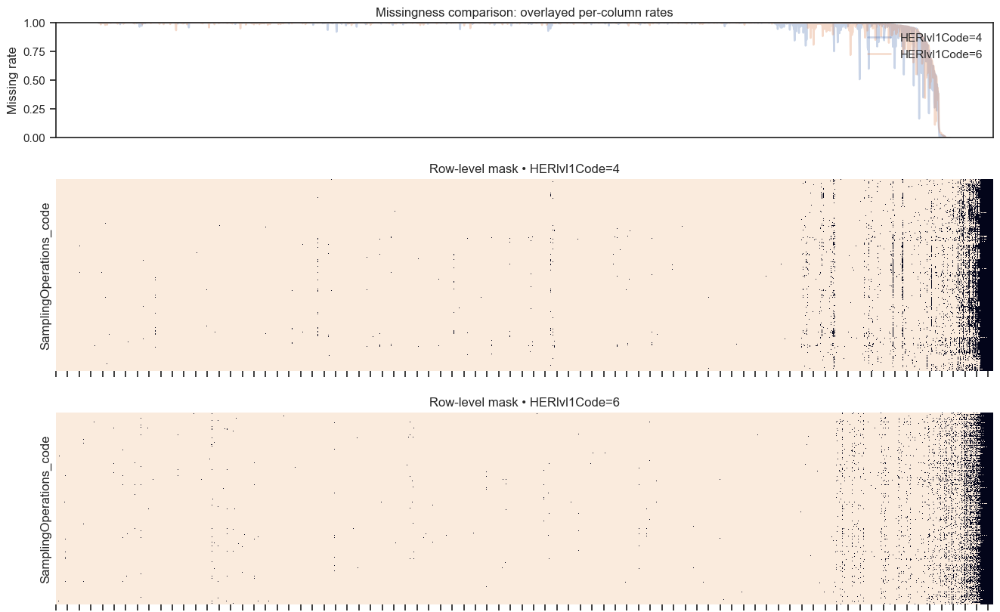

Parece que a cada region se fija comunmente en ciertos taxones

En rojo estan los NaNs, en negro los datos presentes

Hay que hacer un modelo para cada region MINIMO, seria mejor uno por cada region pero JAJAJA "NO TENEMOS LOS RECURSOS"