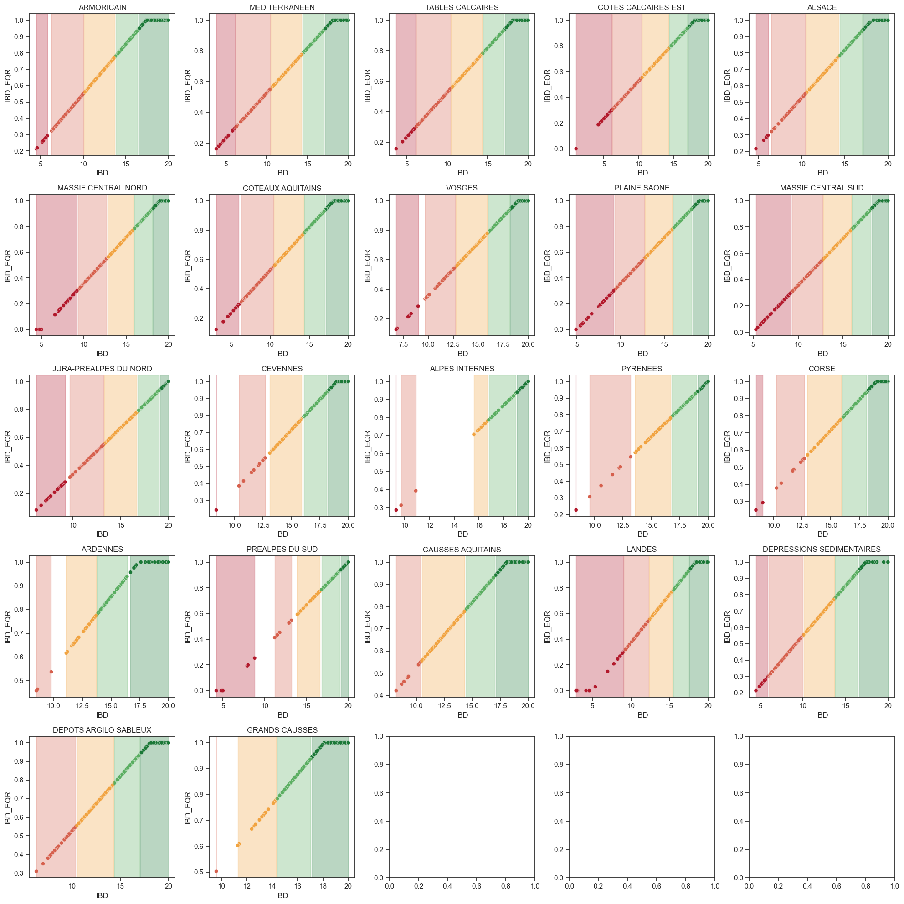

El IBD se comporta diferente en cada region, por lo que es importante hacer un analisis por separado.

Asi se ve por hidroecoregion:

Para clasificar el status, hay huecos:

Utilice el punto medio de los puntos mas extremos entre cada status, Gil ya confirmo que esta bien.:

Los resultados de esta notebook estand en
`data/processed/ibd_eqr_ranges_by_herlvl1_continuous_midpoint.csv`