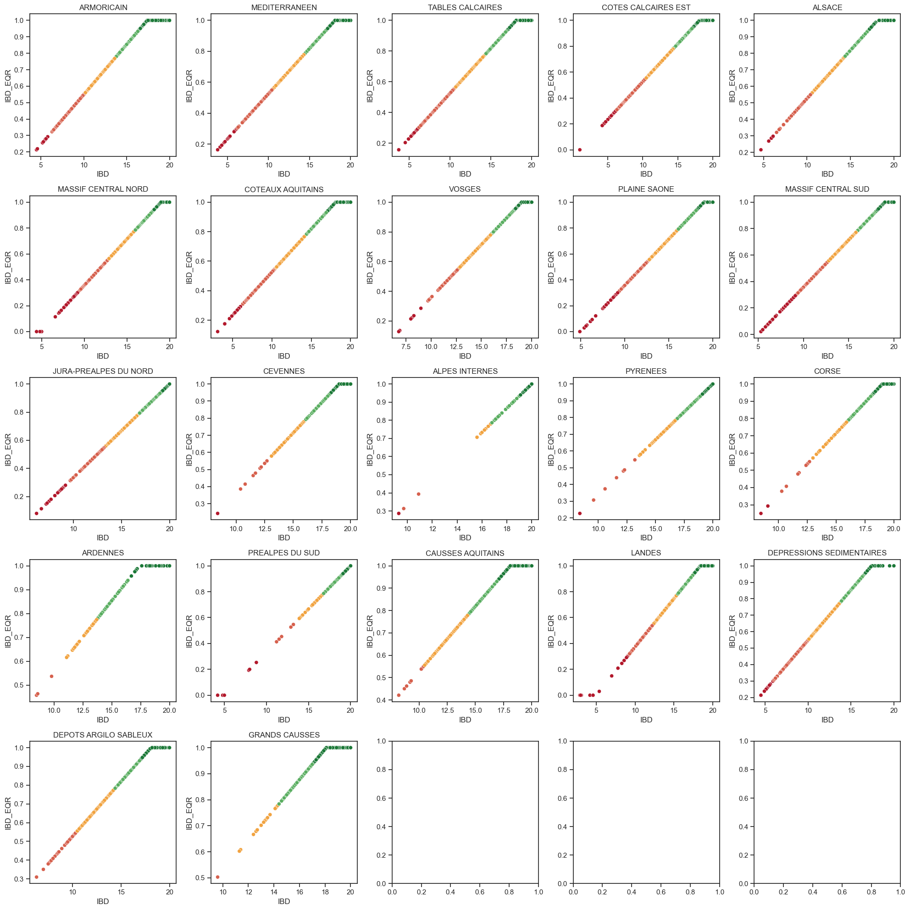
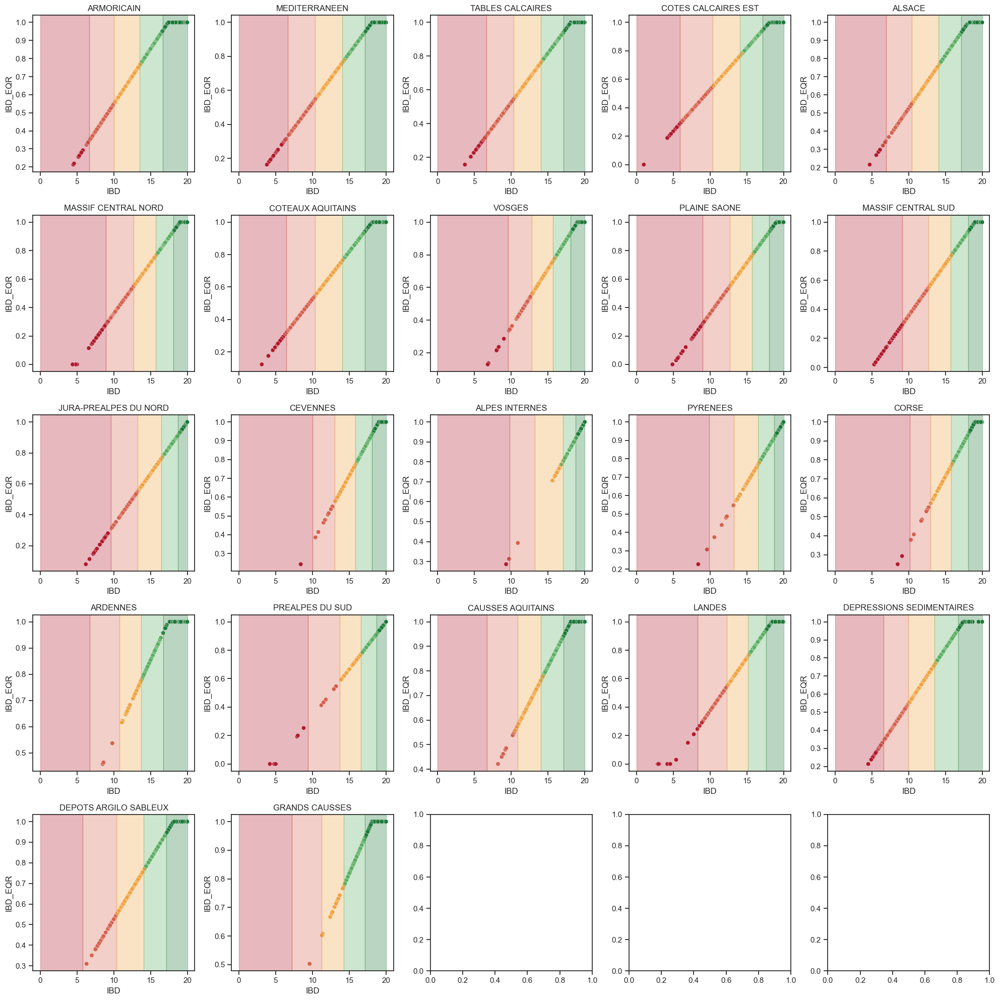

El IBD se comporta diferente en cada region, por lo que es importante hacer un analisis por separado.

Asi se ve por hidroecoregion:

Para clasificar el status, hay huecos:

Utilice el punto medio de los puntos mas extremos entre cada status **NO ESTOY SEGURO SI ESTA BIEN**:
