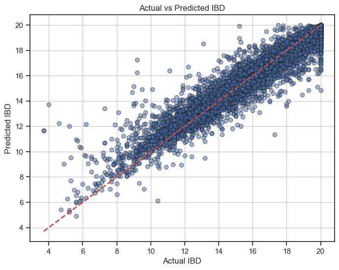
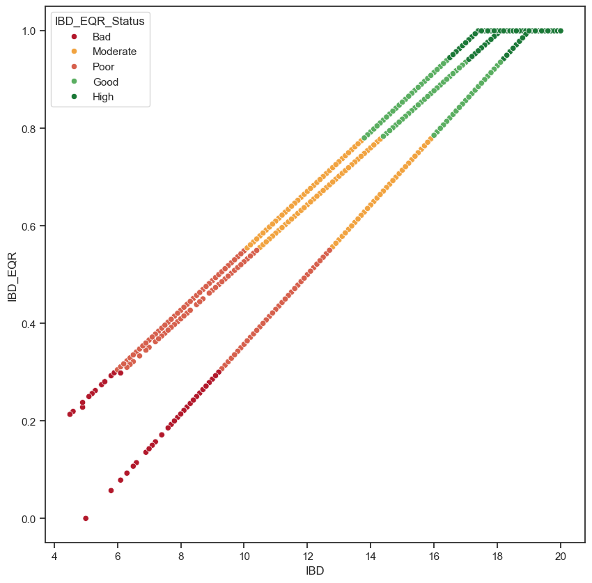

En esta notebook se propone una forma de limpiar la wida db porque eran muchos datos. 

```
path: data/processed/clean_df.parquet
```

Luego se obtiene solo un modelo de Random Forest: 
```
path: results\flirting w models\01 random forest for 1 ibd.joblib
```

```python
Mean Squared Error: 0.7238849809788043
Mean Absolute Error: 0.5332663107609152
R2 Score: 0.9097291236593544
```



Asi se carga el modelo:

```python
import joblib

clf = joblib.load('../../results/flirting w models/01 random forest for 1 ibd.joblib')
clf
```

Este modelo creo que es malo, no estoy seguro si podria mejorar haciendo muchas regresiones por cada hydroecoregion, porque el IBD se ven como 3 regresiones diferentes.



Esta regresion es unica, entonces una mejor regresion serian 3 regresiones diferentes.

O podemos forzar a overfittear el modelo? Como, haciendo que aprenda de sus errores? jajaaajajaj


# 02 Actualizacion de entrenamiento del modelo
12 de octubre

## 01 Random Forest train on train

Train on train significa que hacemos literal train test split EN LOS DATOS DE ENTRENAMIENTO! es para darnos una idea de que tan bien esta funcionando el modelo.

```bash
Mean Squared Error: 0.6825687874343249
Mean Absolute Error: 0.5225425256030023
R2 Score: 0.9147090099387029
```

## 02 Random Forest train on all (to send it to predict)

Este es el modelo que se entrena con todos los datos de entrenamiento, y se usa para predecir los datos de test.
Ojo a las funciones que cree para que se haga rapido el proceso. Si quieren lol