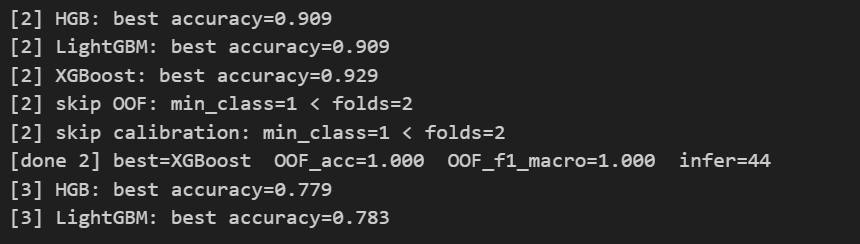

XGBOOST VS LIGHTBOOST VS HISTGRADIENT BOOST

[4] HGB: best accuracy=0.668
[4] LightGBM: best accuracy=0.672
[4] XGBoost: best accuracy=0.676
[4] skip calibration: estimator lacks proba/decision_function
[done 4] best=XGBoost  OOF_acc=0.676  OOF_f1_macro=0.598  infer=102
[5] HGB: best accuracy=0.836
[5] LightGBM: best accuracy=0.844
[5] XGBoost: best accuracy=0.840
[5] skip calibration: estimator lacks proba/decision_function
[done 5] best=LightGBM  OOF_acc=0.844  OOF_f1_macro=0.705  infer=244
c:\Users\175199\.conda\envs\a\Lib\site-packages\sklearn\utils\validation.py:2749: UserWarning: X does not have valid feature names, but LGBMClassifier was fitted with feature names
  warnings.warn(
c:\Users\175199\.conda\envs\a\Lib\site-packages\sklearn\utils\validation.py:2749: UserWarning: X does not have valid feature names, but LGBMClassifier was fitted with feature names
  warnings.warn(
[6] HGB: best accuracy=0.806
[6] LightGBM: best accuracy=0.799
[6] XGBoost: best accuracy=0.806
[6] skip calibration: estimator lacks proba/decision_function
[done 6] best=XGBoost  OOF_acc=0.806  OOF_f1_macro=0.660  infer=236
[7] HGB: best accuracy=0.876
[7] LightGBM: best accuracy=0.871
[7] XGBoost: best accuracy=0.901
[7] skip calibration: estimator lacks proba/decision_function
[done 7] best=XGBoost  OOF_acc=0.901  OOF_f1_macro=0.752  infer=58
[8] HGB: best accuracy=0.774
[8] LightGBM: best accuracy=0.723
[8] XGBoost: best accuracy=0.787
[8] skip OOF: min_class=1 < folds=2
[8] skip calibration: min_class=1 < folds=2
[done 8] best=XGBoost  OOF_acc=1.000  OOF_f1_macro=1.000  infer=79
[9] HGB: best accuracy=0.877
[9] LightGBM: best accuracy=0.875
[9] XGBoost: best accuracy=0.872
[9] skip calibration: estimator lacks proba/decision_function
[done 9] best=HGB  OOF_acc=0.877  OOF_f1_macro=0.620  infer=1118
[10] HGB: best accuracy=0.826
[10] LightGBM: best accuracy=0.829
[10] XGBoost: best accuracy=0.818
[10] skip calibration: estimator lacks proba/decision_function
[done 10] best=LightGBM  OOF_acc=0.829  OOF_f1_macro=0.623  infer=537
c:\Users\175199\.conda\envs\a\Lib\site-packages\sklearn\utils\validation.py:2749: UserWarning: X does not have valid feature names, but LGBMClassifier was fitted with feature names
  warnings.warn(
c:\Users\175199\.conda\envs\a\Lib\site-packages\sklearn\utils\validation.py:2749: UserWarning: X does not have valid feature names, but LGBMClassifier was fitted with feature names
  warnings.warn(
[11] HGB: best accuracy=0.813
[11] LightGBM: best accuracy=0.813
[11] XGBoost: best accuracy=0.820
[11] skip calibration: estimator lacks proba/decision_function
[done 11] best=XGBoost  OOF_acc=0.820  OOF_f1_macro=0.578  infer=148
[12] HGB: best accuracy=0.840
[12] LightGBM: best accuracy=0.840
[12] XGBoost: best accuracy=0.836
[12] skip calibration: estimator lacks proba/decision_function
[done 12] best=LightGBM  OOF_acc=0.840  OOF_f1_macro=0.658  infer=489
c:\Users\175199\.conda\envs\a\Lib\site-packages\sklearn\utils\validation.py:2749: UserWarning: X does not have valid feature names, but LGBMClassifier was fitted with feature names
  warnings.warn(
c:\Users\175199\.conda\envs\a\Lib\site-packages\sklearn\utils\validation.py:2749: UserWarning: X does not have valid feature names, but LGBMClassifier was fitted with feature names
  warnings.warn(
[13] HGB: best accuracy=0.765
[13] LightGBM: best accuracy=0.723
[13] XGBoost: best accuracy=0.768
[13] skip calibration: estimator lacks proba/decision_function
[done 13] best=XGBoost  OOF_acc=0.768  OOF_f1_macro=0.618  infer=115
[14] HGB: best accuracy=0.843
[14] LightGBM: best accuracy=0.848
[14] XGBoost: best accuracy=0.844
[14] skip calibration: estimator lacks proba/decision_function
[done 14] best=LightGBM  OOF_acc=0.848  OOF_f1_macro=0.621  infer=826
c:\Users\175199\.conda\envs\a\Lib\site-packages\sklearn\utils\validation.py:2749: UserWarning: X does not have valid feature names, but LGBMClassifier was fitted with feature names
  warnings.warn(
c:\Users\175199\.conda\envs\a\Lib\site-packages\sklearn\utils\validation.py:2749: UserWarning: X does not have valid feature names, but LGBMClassifier was fitted with feature names
  warnings.warn(
[15] HGB: best accuracy=0.773
[15] LightGBM: best accuracy=0.784
[15] XGBoost: best accuracy=0.789
[15] skip calibration: estimator lacks proba/decision_function
[done 15] best=XGBoost  OOF_acc=0.789  OOF_f1_macro=0.621  infer=124
[16] HGB: best accuracy=0.743
[16] LightGBM: best accuracy=0.686
[16] XGBoost: best accuracy=0.779
[16] skip calibration: estimator lacks proba/decision_function
[done 16] best=XGBoost  OOF_acc=0.779  OOF_f1_macro=0.383  infer=48
[17] HGB: best accuracy=0.758
[17] LightGBM: best accuracy=0.733
[17] XGBoost: best accuracy=0.763
[17] skip calibration: estimator lacks proba/decision_function
[done 17] best=XGBoost  OOF_acc=0.763  OOF_f1_macro=0.542  infer=87
[18] HGB: best accuracy=0.816
[18] LightGBM: best accuracy=0.808
[18] XGBoost: best accuracy=0.818
[18] skip calibration: estimator lacks proba/decision_function
[done 18] best=XGBoost  OOF_acc=0.818  OOF_f1_macro=0.527  infer=187
[19] HGB: best accuracy=0.832
[19] LightGBM: best accuracy=0.770
[19] XGBoost: best accuracy=0.845
[19] skip OOF: min_class=1 < folds=2
[19] skip calibration: min_class=1 < folds=2
[done 19] best=XGBoost  OOF_acc=1.000  OOF_f1_macro=1.000  infer=60
[20] HGB: best accuracy=0.734
[20] LightGBM: best accuracy=0.707
[20] XGBoost: best accuracy=0.750
[20] skip calibration: estimator lacks proba/decision_function
[done 20] best=XGBoost  OOF_acc=0.750  OOF_f1_macro=0.690  infer=60
[21] HGB: best accuracy=0.749
[21] LightGBM: best accuracy=0.745
[21] XGBoost: best accuracy=0.750
[21] skip calibration: estimator lacks proba/decision_function
[done 21] best=XGBoost  OOF_acc=0.750  OOF_f1_macro=0.592  infer=331
[22] HGB: best accuracy=0.675
[22] LightGBM: best accuracy=0.400
[22] XGBoost: best accuracy=0.725
[22] skip calibration: estimator lacks proba/decision_function
[done 22] best=XGBoost  OOF_acc=0.725  OOF_f1_macro=0.543  infer=32

<table border="1" class="dataframe">
  <thead>
    <tr style="text-align: right;">
      <th></th>
      <th>region</th>
      <th>best_name</th>
      <th>report_dir</th>
      <th>oof_acc</th>
      <th>oof_f1_macro</th>
    </tr>
  </thead>
  <tbody>
    <tr>
      <th>0</th>
      <td>3</td>
      <td>LightGBM</td>
      <td>models\best_lightgbm_3_viz</td>
      <td>0.782844</td>
      <td>0.688679</td>
    </tr>
    <tr>
      <th>1</th>
      <td>4</td>
      <td>XGBoost</td>
      <td>models\best_xgboost_4_viz</td>
      <td>0.676113</td>
      <td>0.598226</td>
    </tr>
    <tr>
      <th>2</th>
      <td>5</td>
      <td>LightGBM</td>
      <td>models\best_lightgbm_5_viz</td>
      <td>0.844369</td>
      <td>0.704664</td>
    </tr>
    <tr>
      <th>3</th>
      <td>6</td>
      <td>XGBoost</td>
      <td>models\best_xgboost_6_viz</td>
      <td>0.806112</td>
      <td>0.660306</td>
    </tr>
    <tr>
      <th>4</th>
      <td>7</td>
      <td>XGBoost</td>
      <td>models\best_xgboost_7_viz</td>
      <td>0.901288</td>
      <td>0.752256</td>
    </tr>
    <tr>
      <th>5</th>
      <td>8</td>
      <td>XGBoost</td>
      <td>models\best_xgboost_8_viz</td>
      <td>1.000000</td>
      <td>1.000000</td>
    </tr>
    <tr>
      <th>6</th>
      <td>9</td>
      <td>HGB</td>
      <td>models\best_hgb_9_viz</td>
      <td>0.877299</td>
      <td>0.619569</td>
    </tr>
    <tr>
      <th>7</th>
      <td>10</td>
      <td>LightGBM</td>
      <td>models\best_lightgbm_10_viz</td>
      <td>0.829153</td>
      <td>0.622718</td>
    </tr>
    <tr>
      <th>8</th>
      <td>11</td>
      <td>XGBoost</td>
      <td>models\best_xgboost_11_viz</td>
      <td>0.820333</td>
      <td>0.577581</td>
    </tr>
    <tr>
      <th>9</th>
      <td>12</td>
      <td>LightGBM</td>
      <td>models\best_lightgbm_12_viz</td>
      <td>0.840497</td>
      <td>0.657714</td>
    </tr>
    <tr>
      <th>10</th>
      <td>13</td>
      <td>XGBoost</td>
      <td>models\best_xgboost_13_viz</td>
      <td>0.768018</td>
      <td>0.617629</td>
    </tr>
    <tr>
      <th>11</th>
      <td>14</td>
      <td>LightGBM</td>
      <td>models\best_lightgbm_14_viz</td>
      <td>0.848467</td>
      <td>0.621464</td>
    </tr>
    <tr>
      <th>12</th>
      <td>15</td>
      <td>XGBoost</td>
      <td>models\best_xgboost_15_viz</td>
      <td>0.788899</td>
      <td>0.620563</td>
    </tr>
    <tr>
      <th>13</th>
      <td>16</td>
      <td>XGBoost</td>
      <td>models\best_xgboost_16_viz</td>
      <td>0.779456</td>
      <td>0.382924</td>
    </tr>
    <tr>
      <th>14</th>
      <td>17</td>
      <td>XGBoost</td>
      <td>models\best_xgboost_17_viz</td>
      <td>0.762570</td>
      <td>0.541505</td>
    </tr>
    <tr>
      <th>15</th>
      <td>18</td>
      <td>XGBoost</td>
      <td>models\best_xgboost_18_viz</td>
      <td>0.817810</td>
      <td>0.526514</td>
    </tr>
    <tr>
      <th>16</th>
      <td>19</td>
      <td>XGBoost</td>
      <td>models\best_xgboost_19_viz</td>
      <td>1.000000</td>
      <td>1.000000</td>
    </tr>
    <tr>
      <th>17</th>
      <td>20</td>
      <td>XGBoost</td>
      <td>models\best_xgboost_20_viz</td>
      <td>0.750000</td>
      <td>0.690044</td>
    </tr>
    <tr>
      <th>18</th>
      <td>21</td>
      <td>XGBoost</td>
      <td>models\best_xgboost_21_viz</td>
      <td>0.750429</td>
      <td>0.591722</td>
    </tr>
    <tr>
      <th>19</th>
      <td>22</td>
      <td>XGBoost</td>
      <td>models\best_xgboost_22_viz</td>
      <td>0.725000</td>
      <td>0.542936</td>
    </tr>
  </tbody>
</table>

